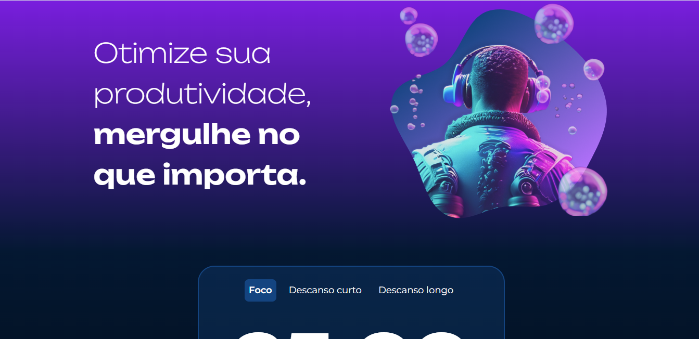
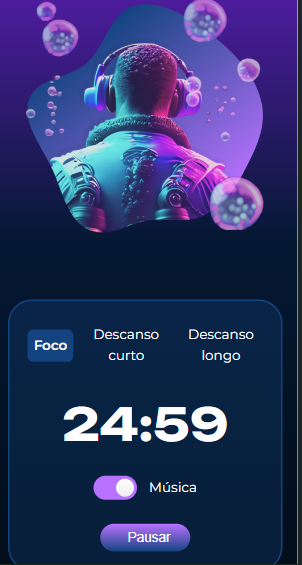

# ✨ Projeto Fokus

## ⚙️ Descrição:

O RelaxTimer é um aplicativo web projetado para ajudar os usuários a relaxarem e descansarem. Com uma interface simples e intuitiva, o aplicativo permite que os usuários cronometrem seu tempo de descanso enquanto ouvem músicas relaxantes. Os usuários podem ajustar o tempo de descanso de acordo com suas necessidades e preferências, além de escolher entre uma variedade de faixas de áudio relaxantes disponíveis. Seja para uma pausa rápida durante o trabalho ou para uma sessão prolongada de relaxamento, o RelaxTimer oferece uma experiência personalizada para ajudar os usuários a recarregar suas energias e reduzir o estresse do dia a dia.

## 🖥️ Recursos:

Cronômetro ajustável para tempo de descanso personalizado.
Seleção de músicas relaxantes para acompanhar o tempo de descanso.
Opção para ajustar o volume e pausar/reproduzir a música.
Interface simples e intuitiva para uma experiência de usuário agradável.
Tecnologias Utilizadas:

## 👋 Tecnologias Usadas

## Contribuição:

Este projeto foi desenvolvido na Alura Cursos.

Capturas de Tela:

